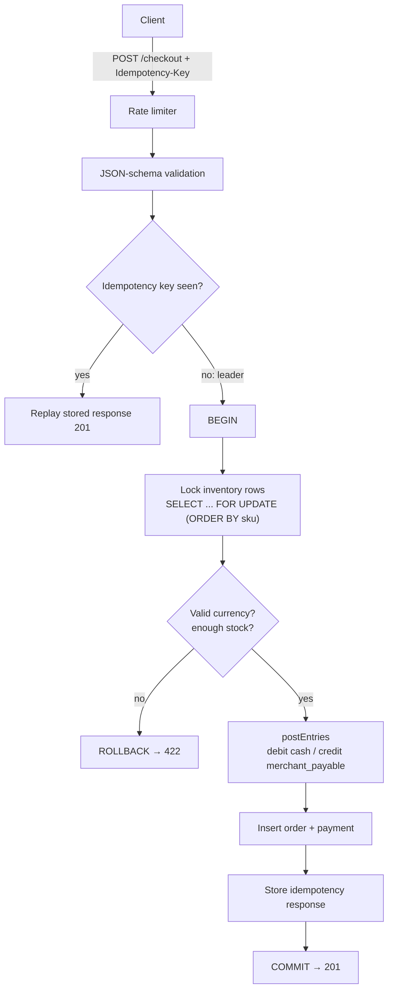

# Kassa

[](https://github.com/Ayuubmahad/kassa/actions/workflows/ci.yml)

> Transaction-safe payments core for a marketplace: a **double-entry ledger** where debits always equal credits, **idempotent APIs** where retrying a checkout charges you once, and **provable correctness under concurrent load**.

The product surface is deliberately small. The engineering underneath is the point.

---

## What it does

- Records every money movement in an **append-only double-entry ledger** (`sum(debits) = sum(credits)`, always).
- Makes every mutating request **idempotent** via `Idempotency-Key` — replay the same checkout, get charged once.
- Handles concurrency (last-item races, double refunds) with DB transactions and row-level locking — *proven with load tests, not promises*.

## Architecture

The checkout path — everything from the lock to the commit is one DB transaction that
either fully succeeds or leaves no trace:



The ledger is the source of truth; account balances are **derived** from raw entries, and an
independent audit re-sums them to prove `Σdebits = Σcredits` (drift = 0).

Core building blocks:

| Piece | File |
| --- | --- |
| Double-entry schema + append-only triggers + constraints | [`db/schema.sql`](db/schema.sql) |
| The one balanced-posting function all money flows through | [`src/ledger/postEntries.ts`](src/ledger/postEntries.ts) |
| Checkout (lock → ledger → payment, atomic) | [`src/checkout/checkout.ts`](src/checkout/checkout.ts) |
| Idempotency (exactly-once via `ON CONFLICT` locking) | [`src/idempotency/idempotency.ts`](src/idempotency/idempotency.ts) |
| Transaction helper + deadlock retry | [`src/db/pool.ts`](src/db/pool.ts) |
| Independent drift / reconciliation checker | [`src/audit/drift.ts`](src/audit/drift.ts) |

### Endpoints (interactive docs at `/docs`)

| Method & path | Purpose |
| --- | --- |
| `POST /checkout` | Reserve stock, post ledger, record payment (idempotent) |
| `POST /payments/:id/refunds` | Full/partial refund with reversal entries (idempotent) |
| `GET /orders/:id` · `GET /payments/:id` | Read an order / payment + refund summary |
| `GET /ledger/accounts` · `GET /ledger/transactions` | Derived balances / recent postings |
| `GET /audit/drift` · `GET /audit/status` | Live invariant + reconciliation report |
| `GET /docs` · `GET /health` · `GET /ready` | OpenAPI UI · liveness · readiness |

## Headline metrics (measured — see [docs/LOAD-TESTING.md](docs/LOAD-TESTING.md))

Load via **k6 over real HTTP**; app compiled, Postgres 16 in Docker; i7-10810U / 17 GB.

1. **0 balance drift** — an independent checker re-sums the whole ledger + reconciles it to the
   business tables after every load scenario and reports `ok`.
2. **p95 = 26.88 ms** at ~200 req/s sustained, **0.00% errors** (mixed checkout storm).
3. **No oversell:** 200 buyers vs stock 100 → exactly 100 succeed, inventory never negative.
4. **No over-refund:** 200 concurrent refunds vs a 100000 payment → refunded sum = 100000 exactly.
5. **Idempotency proven:** 100 concurrent requests sharing one key → exactly **1 charge**.

## Technical decisions & trade-offs

- **Money is integer minor units (öre), never floats.** Floats silently lose cents; a payments core can't. Stored as `BIGINT`.
- **Balances are derived, not stored.** A mutable balance you can't recompute is drift you can't detect. A nightly invariant job (Week 5) re-sums everything.
- **Transactions use one checked-out client**, not `pool.query`, because node-postgres routes each `pool.query` to a possibly-different client — which would corrupt a multi-statement transaction. See `withTransaction`.
- **READ COMMITTED + explicit `FOR UPDATE`**, not SERIALIZABLE. Row locks give deterministic contention handling (proven by the no-oversell / no-over-refund load tests) with far fewer aborts than SERIALIZABLE's predicate-lock retries. I choose the lock points explicitly and document them.
- **Consistent lock ordering** (`ORDER BY sku` before `FOR UPDATE`) plus a **deadlock/serialization retry** (`withTransactionRetry`, retries SQLSTATE 40001/40P01 with jittered backoff) as the safety net — the mixed storm ran at 0.00% failures.

## Where it failed and what I learned

**The 5-second p95.** My first throughput run measured **p95 = 5.16 s** with ~2500 dropped
requests. Every checkout was buying the *same* SKU, so every transaction locked the *same*
inventory row (`FOR UPDATE`) and they all serialized on it — my benchmark had accidentally
recreated single-row contention. Real traffic spreads across many products, so I seeded a
500-SKU catalog and randomised the buys: **p95 dropped to 26.88 ms (~190×)**. A throughput
test has to model realistic key distribution or it just measures your worst lock. Full write-up
in [docs/LOAD-TESTING.md](docs/LOAD-TESTING.md).

---

## Run it

### One command (Docker)

```bash
docker compose up --build
```

Brings up Postgres + the app, applies the schema, and serves on `http://localhost:3000`.
Interactive API docs: `http://localhost:3000/docs` · Health: `GET /health` · Readiness: `GET /ready`.

### Local dev

```bash
cp .env.example .env      # then edit if needed
npm install
docker compose up -d db   # just Postgres
npm run db:migrate        # apply db/schema.sql
npm run dev               # hot-reload server
npm test                  # run the test suite (needs the DB up)
```

### Audit the ledger anytime

```bash
npm run audit:drift     # re-sum the whole ledger; non-zero exit on any drift
npm run audit:refunds   # verify every refund matches a payment
```

## Tech stack

TypeScript · Node 22 · Fastify 5 (+ swagger, rate-limit) · PostgreSQL 16 · Vitest · k6 · GitHub Actions CI

## Status

Weeks 1–6 complete: double-entry ledger, checkout, idempotency, refunds, concurrency-proven
under k6 load (0 drift, p95 27ms), audit jobs, OpenAPI docs, rate limiting. **47 tests, CI green.**
